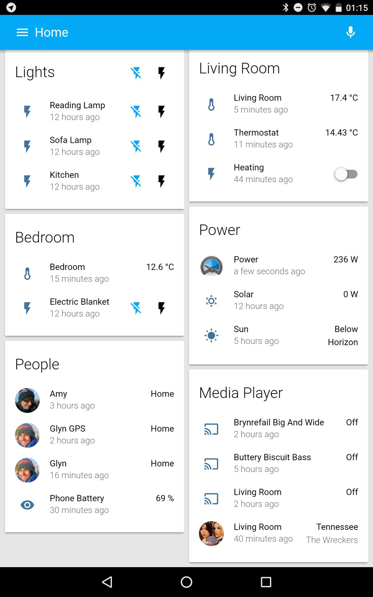
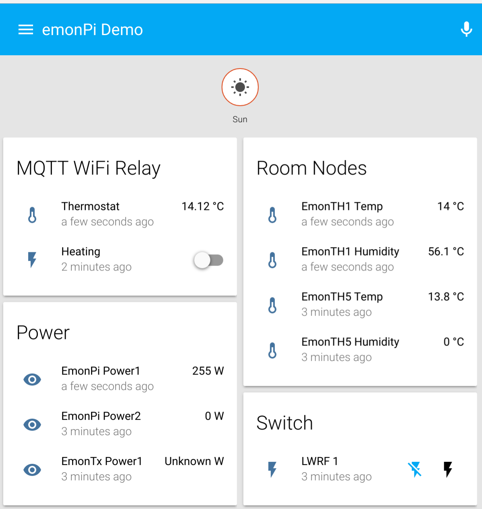

## OpenEnergyMonitor config for Home Assistant

[Home Assistant](https://home-assistant.io/) is an open-source home automation platform running on Python 3.


## My Home Setup Demo

Based on a #emonPi with LightWave RF OOK plug control and MQTT WiFi relay controling my boilder



!Nice mini graph](demo2.png)


## Generic emonPi Config

See `configuration.yaml` in this repo and instructions below to setup the following then customise to your setup:




## Install Home Assistant

For up-to-date install guide see [Home Assistant install guide](https://home-assistant.io/getting-started/)

Assuming starting with Raspbien Jessie (tested on latest emonPi image `emonSD-29Mar16`):

    sudo apt-get install python3-pip
    pip3 install homeassistant

Install and run with OEM configured `configuration.yaml` and custom dir config location on emonPi ~/data R/W partition:

```
mkdir ~/data/home-assistant
ln -s /home/pi/oem_home-assistant/configuration.yaml /home/pi/data/home-assistant/configuration.yaml
hass --config /home/pi/data/home-assistant
```

## Run on boot

```
sudo cp /home/pi/oem_home-assistant/home-assistant@pi.service /lib/systemd/system/home-assistant@pi.service
sudo systemctl --system daemon-reload
sudo systemctl enable home-assistant@pi
sudo systemctl start home-assistant@pi
```

Start / stop with:

    sudo systemctl start home-assistant@pi.service
    sudo systemctl start home-assistant@pi.service

To view log: `sudo journalctl -f -u home-assistant@pi`

## Optional:

```
sudo apt-get install python-Levenshtein
sudo  apt-get install net-tools nmap
```
